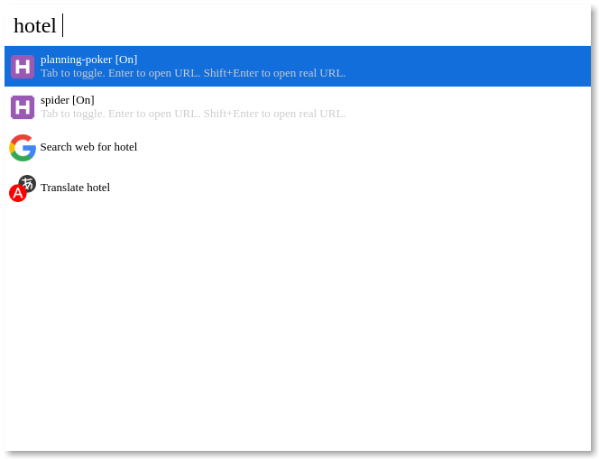

# Cerebro Hotel

> Cerebro plugin that lets you start, stop and open [Hotel](https://www.npmjs.com/package/hotel) apps.

## Usage

In Cerebro, type `hotel` then:

- Press <kbd>Tab</kbd> to toggle server status as running/stopped.
- Press <kbd>Enter</kbd> to open the proxied URL.
- Press <kbd>Shift+Enter</kbd> to open the real URL.

## Settings

This plugin assume your Hotel runs at `http://localhost:2000` and your TLD is `dev`. To change this you need to edit the following envs:

```sh
HOTEL_HOST='http://127.0.0.1:2000'
TLD='dev'
```



## Related

- [Cerebro](http://github.com/KELiON/cerebro) – main repo for Cerebro app;
- [alfred-hotel](https://github.com/exah/alfred-hotel/) - My version is based on this.

## License

[MIT](LICENSE) © [Lubien](http://lubien.me)
